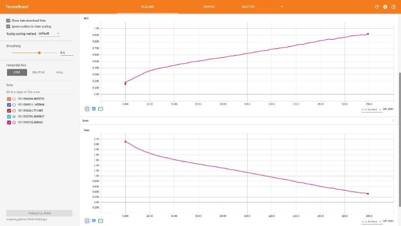
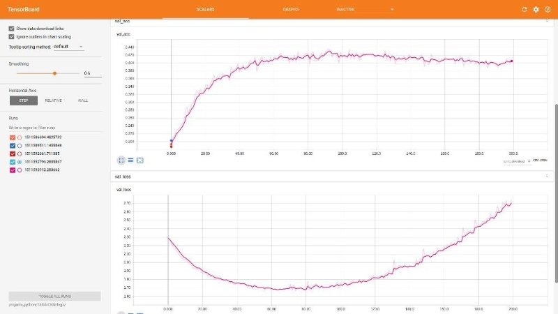

# Convolutional Neural Network built for food item recognition in the TADA application

## Background
Technology Assisted Dietary Assessment (TADA) has been one of Purdue EPICS' most valuable insights for mounting nutrition intervention programs. With the growing concern about obesity, the need to accurately measure food intake has become imperative. For example, dietary assessment among adolescents is problematic as this group has irregular eating patterns and less enthusiasm for recording food intake. Preliminary studies among adolescents suggest that the innovative use of technology may improve the accuracy of dietary information from young people. Recognition of emerging advancements in technology, e.g., higher resolution pictures, improved memory capacity, faster processors, allow these devices to process information not previously possible.

Our goal is to develop, implement, and evaluate a mobile device food record (mdFR) that will translate to an accurate account of daily food and nutrient intake among adolescents and adults. Our first steps include further development of our pilot mobile computing device to include digital images, a nutrient database, and image processing for identification and quantification of food consumption. Mobile computing devices provide a unique vehicle for collecting dietary information that reduces burden on record keepers. Images of food can be marked with a variety of input methods that link the item for image processing and analysis to estimate the amount of food. Images before and after foods are eaten can estimate the amount of food consumed.

The Image Processing team for Fall 2017 has decided to work on three specific modules:
1. A Convolutional Neural Network for food image recognition.
2. A barcode scanner that provides nutritional information.
3. Graph Based Image Segmentation for accurate food item estimation.

This notebook will summarize the work done in developing the Convolutional Neural Network (CNN) for food image recognition. Primarily, the framework that we intended to use was Tensorflow. But, in order to quickly prototype our network architecture, we decided to use Keras, a Deep Learning framework that is built on top of Tensorflow and provides a high level API for users to work with.

## The Architecture of the Model


## The Results

### Understanding the Loss Graphs

#### Validation Loss


#### Test Loss


## Breakdown of the Script for the Neural Network

### Perform the necessary module imports

Some of these modules may need to be installed via pip or Anaconda.

```python
import os
from os import listdir
from keras.utils import np_utils
from keras.models import Sequential
from keras.optimizers import SGD
from keras.layers import Dense
from keras.layers import Flatten
from keras.layers.convolutional import Conv2D, MaxPooling2D
import numpy as np
from scipy.misc import imresize, imread
```

### Initialize class dictionaries

These allow for easy mapping between a particular food type and its corresponding index and vice-versa.

```python
# Two dictionaries to save the classes and their respective indices.
index_to_classes = {}
classes_to_index = {}

# Adding the k-v pairs to the dicts using the custom text file.
with open('assets/classes.txt', 'r') as txt:
    classes = [l.strip() for l in txt.readlines()]
    classes_to_index = dict(zip(classes, range(len(classes))))
    index_to_classes = dict(zip(range(len(classes)), classes))
```

### Load the Food-11 dataset.

We will be using 9866 images for training, 3500 for validation, and 3000 for evaluation.

NOTE: These images are loaded with the assumption that you have the dataset downloaded 

```python
TRAINING_DIR = 'assets/training/'
VALIDATION_DIR = 'assets/validation/'
EVALUATION_DIR = 'assets/evaluation/'

def load_images(root, min_side=32):
    print('Loading ' + root[7:-1] + ' data...')
    images = []
    classes = []

    imgs = sorted(os.listdir(root))

    for img in listdir(root):
        # print('Loading Image: ' + str(counter))
        im = imresize(imread(root + img), (min_side, min_side))
        arr = np.array(im)
        images.append(arr)

        if img[0:2] == '10':
            classes.append(10)
        else:
            classes.append(int(img[0:1]))

    return np.array(images), np.array(classes)


# Loading the training, validation, and evaluation data.
X_tr, Y_tr = load_images(TRAINING_DIR)
X_val, Y_val = load_images(VALIDATION_DIR)
X_test, Y_test = load_images(EVALUATION_DIR)
```

### Normalize the training data.

```python
X_tr = X_tr / 255.0
X_val = X_val / 255.0
X_test = X_test / 255.0

print(np.unique(Y_tr))

Y_tr = np_utils.to_categorical(Y_tr)
Y_val = np_utils.to_categorical(Y_val)
Y_test = np_utils.to_categorical(Y_test)
```

### Initialize the model

It is a five layer model.

```python
# Initializing the sequential model.
model = Sequential()

# Adding the first convolution layer.
model.add(
    Conv2D(32,   # Number of kernels.
           (5, 5),  # Kernel size.
           input_shape=(32, 32, 3),
           padding='same',
           activation='relu'
    )
)

# Adding the first max pooling layer.
model.add(
    MaxPooling2D(
        pool_size=(2, 2)
    )
)

# Adding the second convolutional layer.
model.add(
    Conv2D(64,
           (5, 5),
           input_shape=(16, 16, 32),
           padding='same',
           activation='relu')
)

# Adding the flattening layer.
model.add(
    Flatten()
)

# Adding the fully connected layer.
model.add(
    Dense(
        n_classes,
        activation='softmax'
    )
)
```

### Initialize the hyperparameters and the optimization function.

```python
epochs = 200
batch_size = 100
l_rate = 0.001

decay = l_rate / epochs

sgd = SGD(
    lr=l_rate,
    momentum=0.9,
    decay=decay,
    nesterov=False
)
```

### Add loss metrics, optimization function. Train and test the CNN.

The loss function used is categorical crossentropy, and the optimization function used is Stochastic Gradient Descent.

Train the model and test it after. Once the training session is complete, print the accuracy.

```python
model.compile(
    loss='categorical_crossentropy',
    optimizer=sgd,
    metrics=['accuracy']
)

print(model.summary())

model.fit(
    X_tr,
    Y_tr,
    validation_data=(X_val, Y_val),
    epochs=epochs,
    batch_size=batch_size
)

scores = model.evaluate(
    X_test,
    Y_test,
    verbose=1
)

print('\nAccuracy: %.2f%%' % (scores[1] * 100))
```

### Save the model to a JSON file and the weights to a HDF5 format

```python
model_json = model.to_json()

with open('model1.json', 'w') as json_file:
    json_file.write(model_json)

model.save('my_model1.h5')
model.save_weights('model1_weights.h5')
print('Saved model to disk.')
```

### Load the model from disk

```python
from keras.models import model_from_json

json_file = open('model1.json', 'r')

loaded_model_json = json_file.read()
json_file.close()

loaded_model = model_from_json(loaded_model_json)
loaded_model.load_weights('model1_weights.h5')
print('Loaded model from disk')
```